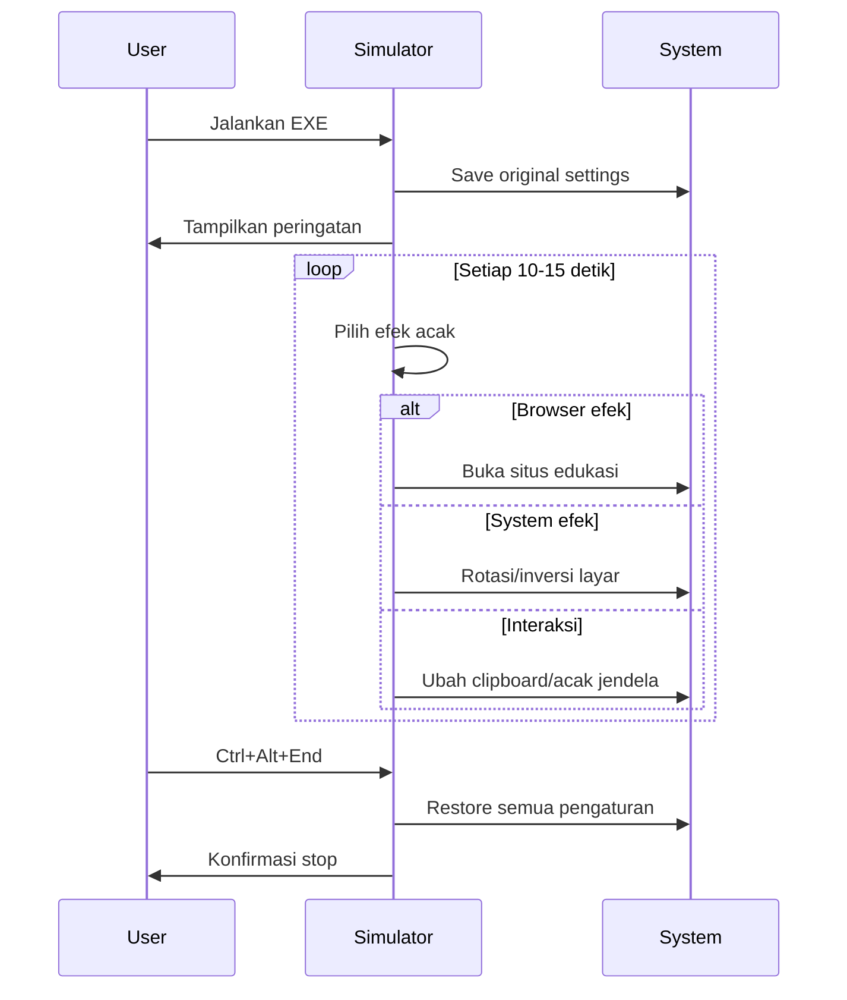

# Advanced Virus Simulation Toolkit (Educational)

## Tujuan Proyek
Proyek ini merupakan simulasi virus komputer edukasional yang dirancang untuk:
- Mendemonstrasikan teknik malware modern secara aman
- Meningkatkan kesadaran keamanan siber (cybersecurity awareness)
- Menyediakan alat pembelajaran untuk pelatihan blue team/red team
- Membantu pembuat konten YouTube membuat demo keamanan yang menarik
- Mengajarkan mitigasi ancaman secara praktis

> ⚠️ **Peringatan Penting:** Proyek ini hanya untuk tujuan edukasi. Dilarang digunakan untuk tujuan jahat atau destruktif.

## Fitur Simulasi

### Efek Visual
| Fitur             | Deskripsi                     | Durasi         |
|------------------|-------------------------------|----------------|
| Screen Rotation  | Memutar orientasi layar 180°  | 5 detik        |
| Color Inversion  | Membalikkan warna layar       | 3 detik        |
| Screen Shake     | Menggoyangkan semua jendela   | 1 detik        |
| Wallpaper Change | Mengganti wallpaper sementara | Sampai stop    |
| Random Beeps     | Suara sistem acak             | 100-500ms      |

### Efek Sistem
| Fitur               | Deskripsi                         | Frekuensi        |
|---------------------|-----------------------------------|------------------|
| Process Monitoring  | Restart browser jika ditutup      | Setiap 10-15 detik |
| Browser Redirection | Membuka situs edukasi/prank       | Acak             |
| Window Randomization| Ubah posisi & ukuran jendela      | Acak             |
| Mouse Jitter        | Gerakan mouse acak                | Acak             |
| Fake Error Messages | Peringatan sistem palsu           | Acak             |
| Clipboard Hijack    | Ganti isi clipboard               | Acak             |
| Desktop Spam        | Buat file teks di desktop         | Saat inisialisasi |

- Balloon tips untuk semua aksi
- Menu edukasi (F1)
- Peringatan awal saat memulai
- Konfirmasi saat pause/stop

## Persyaratan Sistem

### Minimal
- Windows 7 atau lebih baru
- Prosesor 1GHz (x86/x64)
- 512MB RAM
- 10MB ruang disk
- Akses internet (untuk fitur browser)

### Direkomendasikan
- Windows 10/11
- Prosesor 2-core 2GHz+
- 2GB RAM
- GPU dengan dukungan DirectX 9+
- Virtual Machine (VMware/VirtualBox)

## Panduan Instalasi

### Versi Precompiled (Untuk Pengguna Umum)
1. Download binary terbaru dari Releases Page
2. Ekstrak zip ke folder khusus
3. Jalankan `VirusSimulator.exe`
4. Wajib baca peringatan yang muncul
5. Gunakan hotkey untuk kontrol

### Untuk Pengguna Lanjutan (PowerShell)
```powershell
Invoke-WebRequest -Uri "https://example.com/VirusSimulator.zip" -OutFile "VirusSimulator.zip"
Expand-Archive -Path "VirusSimulator.zip" -DestinationPath ".\VirusSim"
cd .\VirusSim
.\VirusSimulator.exe
```

## Kompilasi dari Sumber

### Persyaratan
- MinGW-w64 (GCC) atau Visual Studio 2019+
- Windows SDK
- Paket dev: `gdi32`, `comctl32`, `winmm`, `shell32`

### Menggunakan MinGW
```bash
winget install MinGW.MinGW
gcc -mwindows simulator.c -o VirusSimulator.exe \
    -lcomctl32 -lwinmm -lgdi32 -lshell32 \
    -O2 -s -fstack-protector-strong
file VirusSimulator.exe
```

### Visual Studio
- Buat proyek baru: Windows Desktop Application
- Tambahkan file sumber
- Atur linker:
  - `SubSystem = Windows (/SUBSYSTEM:WINDOWS)`
  - `Additional Dependencies = comctl32.lib;winmm.lib;gdi32.lib;shell32.lib`

## Panduan Penggunaan

### Skenario Umum


### Skenario Edukasional
- **Demonstrasi Kelas**
  - Jalankan simulasi di VM
  - Tunjukkan teknik social engineering
  - Diskusikan mitigasi

- **Pelatihan Incident Response**
  - Beri peserta VM terinfeksi
  - Instruksikan identifikasi efek
  - Temukan cara menghentikan

- **Pembuatan Konten**
  - Rekam simulasi dengan OBS
  - Zoom in pada efek spesifik
  - Jelaskan teknik malware nyata

## Kontrol Hotkey

| Kombinasi           | Fungsi              | Indikator               |
|---------------------|---------------------|--------------------------|
| Ctrl + Alt + End    | Emergency stop      | Notifikasi & restore     |
| Ctrl + Alt + D      | Toggle pause/resume | Balloon tip status       |
| Ctrl + Alt + R      | Reload program      | Restart proses           |
| F1                  | Menu edukasi        | Dialog informasi         |

## Mekanisme Keamanan

### Protokol Keamanan

- **Environment Detection**
  - Deteksi VM (opsional)
  - Cek user privileges

- **Resource Limitation**
  - Batasi efek ke 5 detik maks
  - Tidak ada operasi file destruktif
  - Tidak ada perubahan registry

- **Recovery System**
  - Backup pengaturan awal
  - Restore otomatis saat exit
  - Cleanup file temporer

## Penjelasan Edukasional

### Teknik Malware yang Disimulasikan

| Teknik             | Contoh Nyata           | Simulasi            | Mitigasi                 |
|--------------------|------------------------|----------------------|---------------------------|
| Social Engineering | Fake AV warnings       | Dialog error palsu   | Verifikasi alert asli     |
| Persistence        | Autostart entries      | Process monitoring   | Monitor startup           |
| Browser Hijacking  | Malicious extensions   | Redirect ke situs    | Gunakan extension trusted |
| System Modification| Registry changes       | Rotasi layar         | System restore points     |
| User Annoyance     | Ransomware notes       | Clipboard hijack     | Sandboxing aplikasi       |

### Statistik Ancaman (2023)
- 560,000 malware baru per hari (AV-TEST)
- Kerugian global: $8 triliun (2023)
- 94% malware via email
- 75% serangan targeted

### Best Practices Keamanan
- Gunakan antivirus reputasi baik
- Update sistem & aplikasi rutin
- Backup data 3-2-1 (3 salinan, 2 media, 1 offsite)
- Hindari klik link/attachment mencurigakan
- Gunakan MFA (Multi-Factor Authentication)

## FAQ

**Q: Apakah ini virus sungguhan?**  
A: TIDAK! Ini hanya simulasi dengan efek tidak permanen.

**Q: Bisakah merusak sistem saya?**  
A: Tidak, selama digunakan sesuai petunjuk. Semua efek direversi saat stop.

**Q: Mengapa antivirus mendeteksi sebagai ancaman?**  
A: Karena simulasi menggunakan teknik mirip malware. Anda bisa:
- Whitelist file
- Kompilasi sendiri dari sumber
- Jalankan di VM terisolasi

**Q: Bagaimana cara verifikasi keamanan?**  
A:
- Periksa kode sumber
- Scan dengan VirusTotal
- Analisis perilaku di sandbox

**Q: Dapatkah dimodifikasi untuk tujuan jahat?**  
A: Tujuan proyek murni edukasi. Penyalahgunaan melanggar lisensi dan hukum.

## Kontribusi

- Buka issue sebelum membuat PR
- Pertahankan fokus edukasi
- Tidak tambahkan fitur destruktif
- Ikuti pedoman kode

### Area pengembangan
- Tambahkan modul jaringan
- Simulasi serangan ransomware (non-destruktif)
- GUI konfigurasi
- Logging aktivitas

## Lisensi

```
Copyright 2023 Cybersecurity Educator Team

Licensed under the Educational Community License v2.0 (ECL-2.0)

Izin diberikan hanya untuk tujuan edukasi dan non-komersial.
Dilarang menyalahgunakan proyek ini untuk:
- Aktivitas ilegal
- Penipuan
- Tujuan destruktif

Lisensi lengkap: https://opensource.org/license/ecl-2-0
```